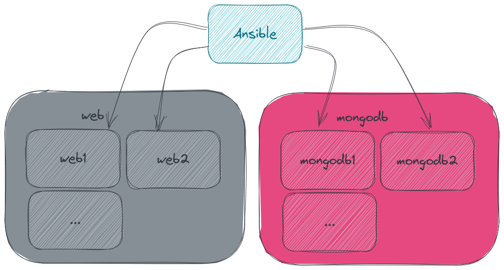
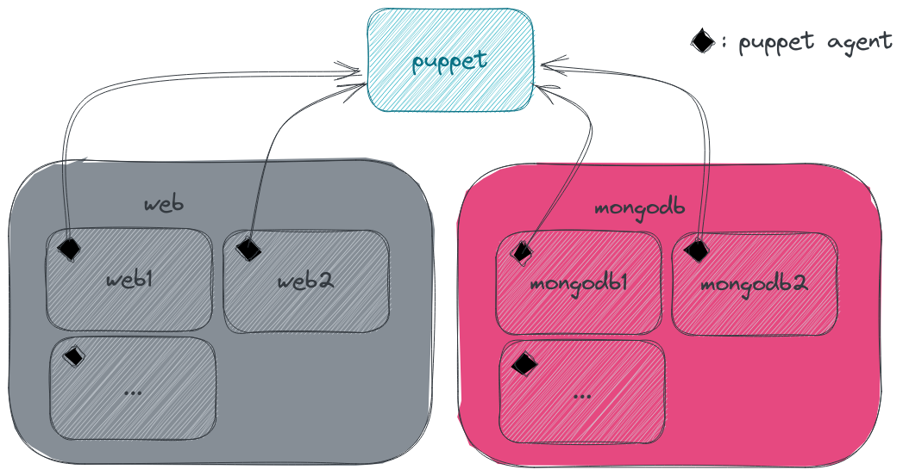
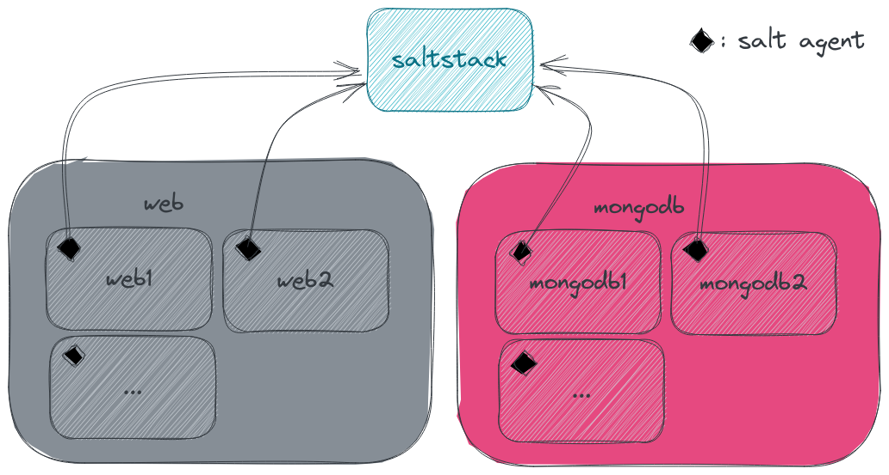

# Intro

- [Intro](#intro)
  - [What is an automation software](#what-is-an-automation-software)
  - [What is Ansible](#what-is-ansible)
  - [Why use Ansible](#why-use-ansible)
  - [Alternative to Ansible](#alternative-to-ansible)
    - [Puppet](#puppet)
    - [SaltStack](#saltstack)
  - [How to install Ansible](#how-to-install-ansible)
    - [Packages](#packages)
    - [Pip](#pip)

## What is an automation software

An *automation software* allow you to automate complex business processes. It typically has three functions: automating processes, centralizing information, and reducing the requirement for input from people. It is designed to remove bottlenecks, reduce errors and loss of data, all while increasing transparency, communication across departments, and speed of processing.

## What is Ansible

Ansible is an open source IT automation tool that automates provisioning, configuration management, application deployment, orchestration, and many other manual IT processes. Unlike more simplistic management tools, Ansible users (like system administrators, developers and architects) can use Ansible automation to install software, automate daily tasks, provision infrastructure, improve security and compliance, patch systems, and share automation across the entire organization.

## Why use Ansible

Ansible is the most straight forward, simplest and yet still powerful automation software.

It use [SSH](https://en.wikipedia.org/wiki/Secure_Shell) to connect to remote machines with no more requirements on the target machine.



It also use popular [YAML](https://yaml.org/) language for the base of it's configuration: playbooks

```yaml
---
  - name: Playbook
    hosts: webservers
    become: yes
    become_user: root
    tasks:
      - name: ensure apache is at the latest version
        yum:
          name: httpd
          state: latest
      - name: ensure apache is running
        service:
          name: httpd
          state: started
```

Even if the basics are simple enough, it's huge capacity for customization allow it to be very versatile (see [modules](https://docs.ansible.com/ansible/latest/plugins/module.html) and [roles](https://docs.ansible.com/ansible/latest/user_guide/playbooks_reuse_roles.html)).

## Alternative to Ansible

Other software exists to replace Ansible but they will most likely work differently.

### Puppet



### SaltStack



## How to install Ansible

There are severall ways to install ansible, the easiest is to use the package provided by your distribution.

### Packages

**Red Hat**:

```bash
sudo yum install ansible
```

**Debian/Ubuntu**:

```bash
sudo apt install ansible
```

**Fedora**:

```bash
sudo dnf install ansible
```

### Pip

The advantage of using a pip installation of Ansible is that you will probably have the most recent version of Ansible whereas the distribution packages will lack behind.

```bash
pip install ansible
```

| :exclamation:  It's best to install in a virtual environment |
|--------------------------------------------------------------|